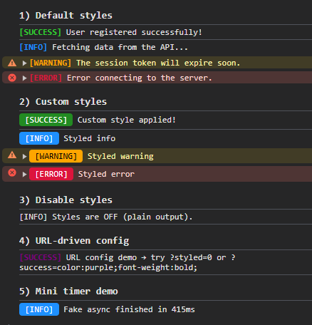

# ChromaLog — Pretty Console Badges for the Browser (TypeScript)

**ChromaLog** is a tiny, dependency‑free logger that prints **colored, badge‑style messages** in the browser console. It helps you quickly scan successes, infos, warnings and errors in large traces. Built in TypeScript.

[](#license)


> Keywords: *browser console logger, colored console logs, styled console, TypeScript logger, React logger, JavaScript logging utility, console badges, pretty logs*.

---

## Features
- ✅ **Colored badges** per level: `success`, `info`, `warning`, `error`.
- ✅ **Right console method** per level (`console.info`, `console.warn`, `console.error`).
- ✅ **Level icons** (✅ ℹ️ ⚠️ 🛑) for faster scanning.
- ✅ **Auto light/dark theme** based on `prefers-color-scheme`.
- ✅ **Enable/disable** globally via `ChromaLog.config({ enabled: false })`.
- ✅ Zero dependencies, **TypeScript** typings, tiny footprint.

---

## Install

```bash
npm i @hunab/chromalog
# or
yarn add @hunab/chromalog
# or
pnpm add @hunab/chromalog
```

> CDN (when published):  
> `<script type="module" src="https://unpkg.com/@hunab/chromalog/dist/index.es.js"></script>`

---

## Quick Start

```ts
import { ChromaLog } from '@hunab/chromalog';

ChromaLog.success('User registered successfully!');
ChromaLog.info('Fetching data from the API...');
ChromaLog.warning('The session token will expire soon.');
ChromaLog.error('Error connecting to the server.');
```

---

## Customize Styles

```ts
ChromaLog.config({
  styles: {
    success: 'color:white;background:forestgreen;padding:2px 8px;border-radius:4px;',
    info: 'color:white;background:dodgerblue;padding:2px 8px;border-radius:4px;',
    warning: 'color:black;background:orange;padding:2px 8px;border-radius:4px;',
    error: 'color:white;background:crimson;padding:2px 8px;border-radius:4px;'
  }
});

ChromaLog.success('Custom style applied!');
```

---

## Disable / Enable (Production Toggle)

Silence logs globally (e.g., on production):

```ts
ChromaLog.config({ enabled: false }); // disable all styled logs
// later...
ChromaLog.config({ enabled: true }); // re-enable
```

You can wire this to your build env:
```ts
ChromaLog.config({ enabled: import.meta.env.DEV });
```

---

## URL‑Driven Config (for demos)

Tweak styles **without changing code** during demos:

- `?styled=0` → disables styles.
- `?success=color:purple;font-weight:bold;` → overrides the `success` badge CSS.

Demo handler:

```ts
const params = new URLSearchParams(location.search);
if (params.get('styled') === '0') ChromaLog.config({ styled: false });
const successStyle = params.get('success');
if (successStyle) ChromaLog.config({ styles: { success: successStyle } });
```

Optional quick links for your demo page:

```html
<p>
  Try:
  <a href="?styled=0">?styled=0</a> |
  <a href="?success=color:purple;font-weight:bold;">?success=purple+bold</a>
</p>
```

---

## API

```ts
// Global configuration
ChromaLog.config(options: {
  styled?: boolean;          // default: true
  enabled?: boolean;         // default: true
  styles?: Partial<{
    success: string;
    info: string;
    warning: string;
    error: string;
  }>;
});

// Log methods
ChromaLog.success(...args: any[]): void;
ChromaLog.info(...args: any[]): void;
ChromaLog.warning(...args: any[]): void;
ChromaLog.error(...args: any[]): void;
ChromaLog.log(...args: any[]): void; // raw console.log
```

---

## Screenshot

Add a screenshot of your console output to help users instantly see the value:

```
docs/screenshot.png
```

```md

```

---

## Browser Support

ChromaLog uses the `%c` console formatter, supported by all modern browsers (Chrome, Edge, Firefox, Safari).  
If a browser doesn’t support `%c`, it will fall back to plain text.

---

## Roadmap
- Namespaces and filters (e.g. `auth:*`, `cart:*`).
- Optional Node/React Native ANSI fallback.
- Grouped logs and lightweight timers.
- Theme presets (ocean / sunset / mono).

---

## License

MIT © 2025 Hunab Labs
